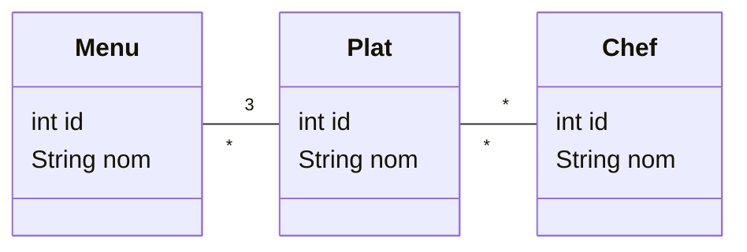

# API de gestion de menus
> Nicolas Crausaz et Maxime Scharwath

Le but de notre API est de permettre la maintenance d'un menu de la semaine pour un restaurant.
Les actions possibles sont la création, l'édition et la suppression de menus.

# Documentation de l'API

La documentation Swagger des endpoints de l'API est accessible ici: http://localhost:9090/api

# UML

Nous avons 3 entités principales: Menu, Plat et Chef.
Un menu est composé de 3 plats (entrée, plat principal et dessert) et un plat est réalisé par plusieurs chefs.

# Vidéo de présentation

[Lien de la vidéo](https://www.youtube.com/watch?v=hMDEsRNvUXw)

<!--# menus-exemple
Mise en oeuvre d'une api avec Springboot et d'un client de test BDD avec Cucumber 
Avec OpenApi generator, génération à partir d'un fichier OpenAPI "menus.yaml" :
 - des intertaces et des DTO pour Springboot
 - d'un client et des DTO pour le client BDD
 
 ## Installation et utilisation avec IntelliJ
  - git clone de ce repository et import sous IntelliJ du projet (maven) qui contient 2 modules : menus-api pour Springboot
 et menus-spec pour le client BDD
  - Affectation d'un Java JDK 17 (File / Project structure / Project /SDK
 ### menus-api
  - Gérération du dossier target avec "maven clean package" (fenêtre Maven, menus-exemple/menus-api/Lifecycle)
  - Déclaration "Generated Source Root" du dossier target/generated-sources/openapi/src/main/java 
    via le menu contextuel et "Mark directory as" sur ce dossier
  - Lancement du main Springboot (Swagger2SpringBoot)
  - L'interface utilisateur swagger-ui est accessible à http://localhost:9090/api
  - La base de donnée H2 est accessible à http://localhost:9090/api/h2-console
      url: jdbc:h2:mem:testdb username:sa pas de password
  ### menus-spec
  - Gérération du dossier target avec "maven clean package" (fenêtre Maven, menus-exemple/menus-spec/Lifecycle)
    si Springboot tourne, les tests BDD doivent s'exécuter sans erreurs au cours de l'exécution de Maven
  - Déclaration "Generated Source Root" du dossier target/generated-sources/openapi/src/main/java 
  - La Feature Cucumber du dossier src/test/resources/features/menus.feature doit être exécutable sous IntelliJ
  
  ## Cycle de développement
  - Modifier le fichier OpenAPI "menus.yaml" sous src/main/resource des 2 projets (copies identiques)
  - Api Springboot
    - Relancer "maven clean package" de menus-api
    - Développer ou adapter les controlleurs, les DTO et les classes liées dans l'api Springboot
    - Si vous avez ajouté ou modifié des entités, vous pouvez initialiser des données 
      dans le fichier data.sql de src/main/resource
    - Relancer Sprigboot et faire quelques tests manuels avec swagger-ui
  - Tests BDD cucumber (en mode TDD, les 2 premières étapes peuvent être effectuées avant le développement de l'api)
    - Relancer "maven clean package" de menus-spec, les tests seront peut-être en erreur et peuvent être skippés
    - Développer ou adapter les features Cucumber et les steps pour les nouvelles fonctionalités
    - Exécuter les tests sous IntelliJ et relancer "maven clean package" de menus-spec pour exécuter les tests avec Maven
  
    -->
